

# 守护龙纪事

**THE DRAGON WORLD ONLINE**

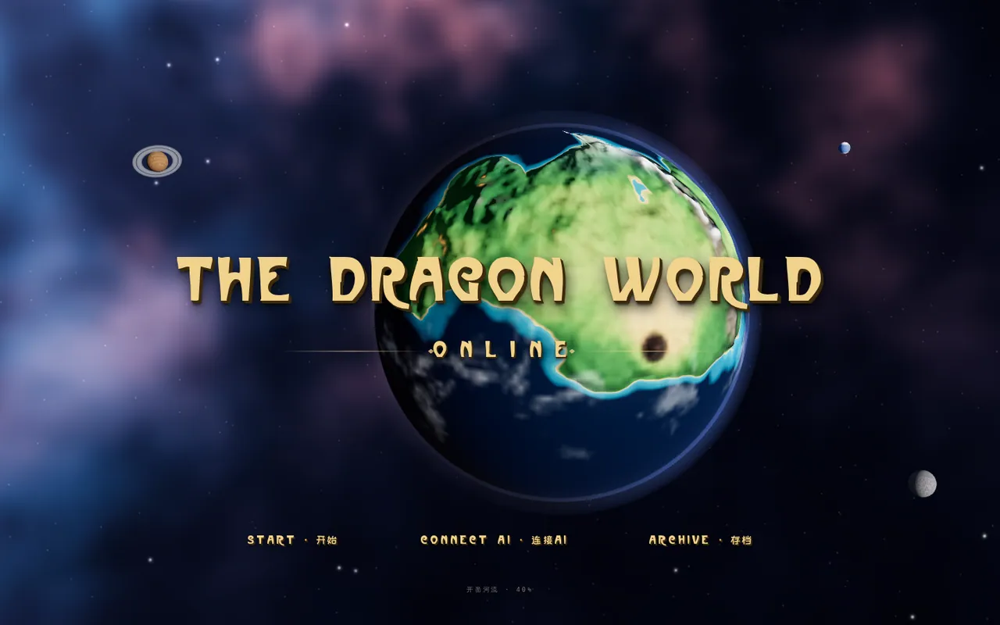

---

## 这是什么

一部跑在浏览器里的文字角色扮演游戏。

它取材自小说《无论你是否称呼我为守护龙，我都要去睡觉》全 649 章，把这部作品的时间线切成 **三十二个纪年**——从「创世与第一批生命」，一路走到「娱乐、银行与报纸」的近代。

每一纪都不是一段简介，而是一整套能住进去的资料：那一纪存在的国家与灾变、那一纪还活着的人、那一纪买得到的东西、那一纪的地图长什么样。你挑一纪、挑一个人、挑一处地方，游戏从原作那一段的**逐字原文**开局，之后每一回合由你自己接上的 AI 接着写。

两条规矩贯穿全篇：**开局那一段是原文，不改写**；**世界书只负责告诉模型「到此刻为止，什么已经是已知的」，不新造正典**。第 3 纪的角色不会知道第 20 纪才发生的事。

---

## 一局是怎么开始的

### 一 · 纪年长廊

三十二张纪年插画排成一条可以拖动的长廊。停在哪一张，下面就写着那一纪的年号、跨越的原文章节，和这一纪有多少个可进入的节点。

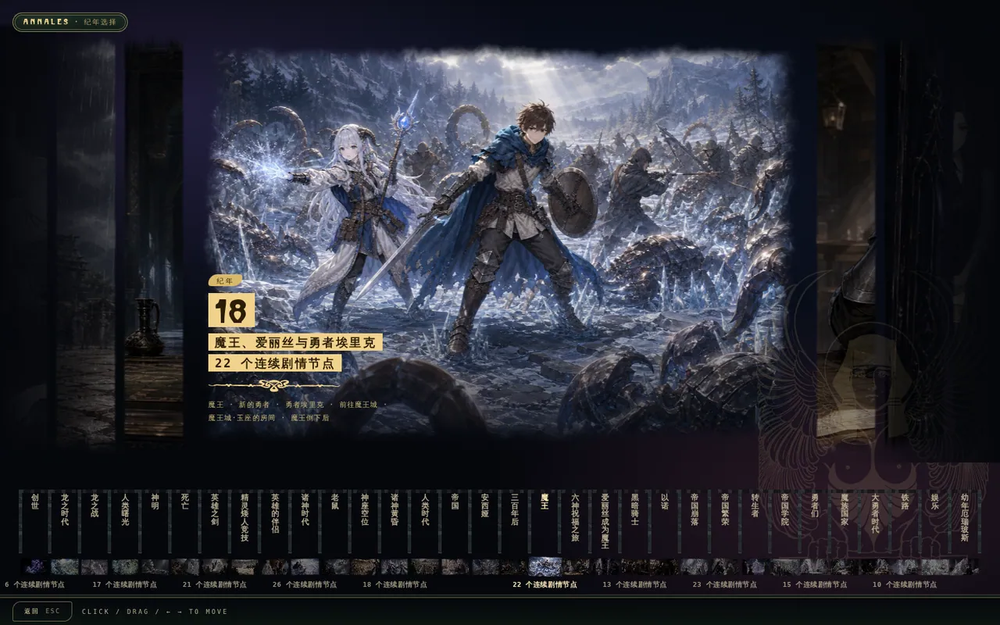

点开任意一纪，先给你一份不剧透后文的交底：**第一次看也能懂**的世界前提、此前的完整历史、紧接这一节点的前情、本节点的完整剧情，以及这一局具体从原作哪一章开始。看完了再决定进不进。

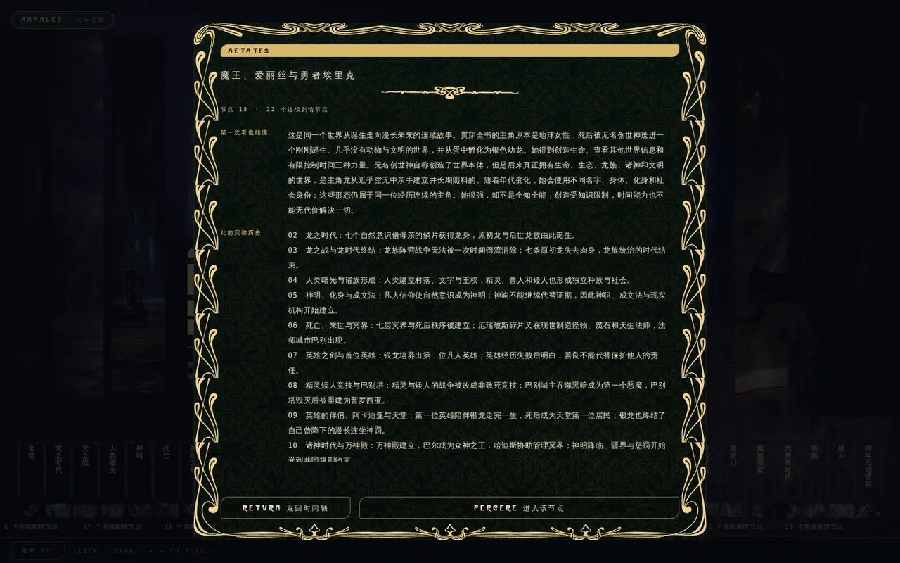

### 二 · 铸局

进入之前有四步：**地点 · 人物 · 同伴 · 开场**。

**地点**——星球在你面前转。这一纪存在的地点亮在球面上，点一个就落脚在那里；也可以点球面上任意一处空白座标，自己定一个没有名字的地方。还能直接改地形：抬地、造山、铺生物群系，再给它立一座自己的城市或村庄，取名、写志略，之后就是一处可以前往的坐标。

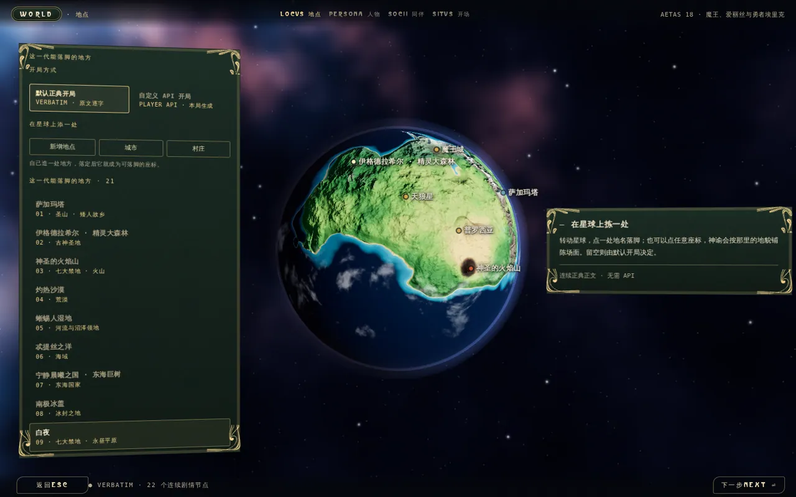

**人物**——这一纪能选的角色卡摊在面前，立绘、身份、声口、心声、知识边界都写在卡上。不想演谁都可以：换成自定义，自己填物种与身体形态、社会位置、眼前目标和知识范围。

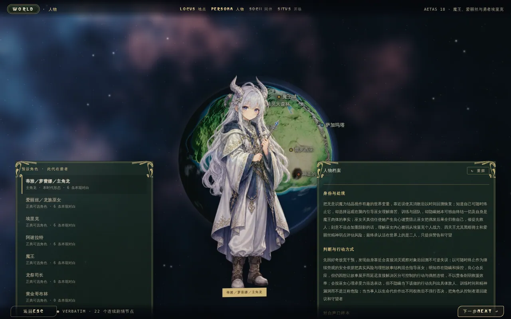

**同伴**与**开场**——挑几位一起上路的人，再看一眼这一局的开场原文。确认，进入正文。

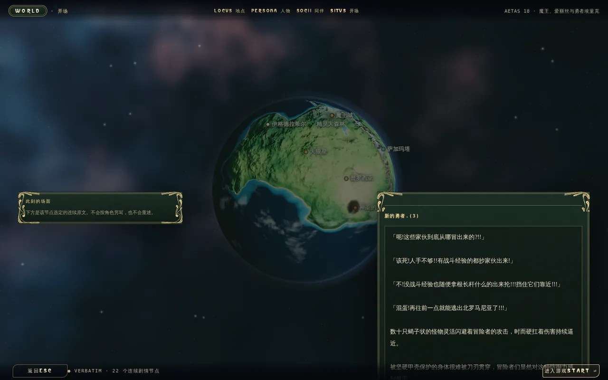

### 三 · 正文

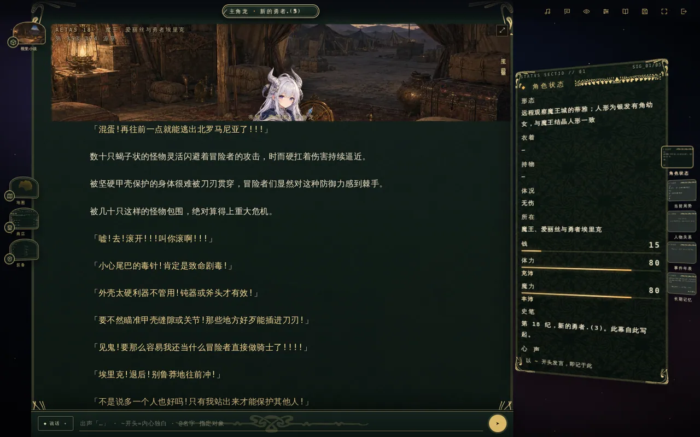

正中是正文台。底下那条输入栏有六种模式：**说话 · 动作 · 随便写 · 聊天模式 · 写信 · 建造**。说话可以用 `「」` 出声、`~` 开头写内心独白、`@名字` 指定对象；「建造」下一道营造或征发的令，是要折损恩宠的。每一幕之后，输入框里还会用浅字提一句你可能想打的话，按 Tab 采纳，直接打字就盖掉。

---

## 视觉小说

正文台上方那扇窗可以一路放大到全屏。全屏之后就是 galgame 的老规矩：画面归画面，字归底下那一条框，一句一句点过去。

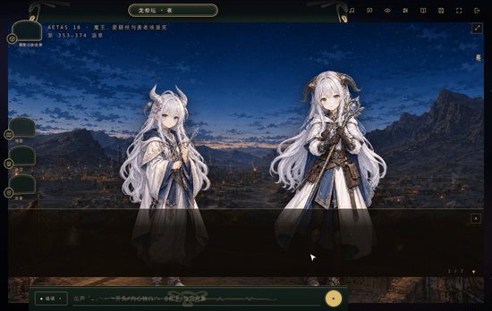

场景背景是按当前的地点与天气认出来的——同一纪里，「商队宿营地」和「雪原深处」不会是同一张图，夜里和雪天也不一样。谁在说话，谁的立绘就亮起来，其他人压暗，名牌跟着换。

---

## 一颗真的星球

不是一张贴图。泛大陆是一颗可以拖着转、滚轮缩放的球，有昼夜晨昏线、有云、有大气散射，背后是星云与几颗别的行星。

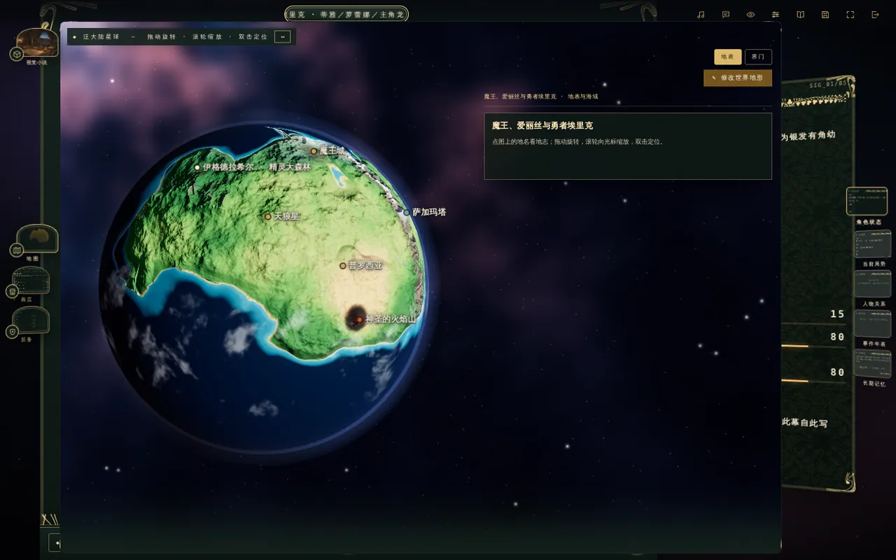

三十二个纪年发生在同一颗星球上，地形会随灾变改变——新大陆隆起、天狼星崩落、魔王城升空。只有原文明确属于地表、海洋或地表入口的地点才会放上球面；天堂、冥界与地下城异空间不会伪装成大陆。

正文里点开地图，选中一处地点会给出「确认前往」；按下去，下一回合就是这一路的见闻与抵达时眼前的场面。

---

## 情报台

右边那一列是这一局的仪表盘，卡叠式排布：**角色状态**（形态、衣着、持物、体况、所在、钱、体力、魔力、心声）、**在场人物**、**当前局势**、**人物关系**、**事件年表**、**长期记忆**。

人物关系是一张可以拖拽、缩放的关系图，点开任意一位就是他的列传：身份、对白声口、直接心声、知识边界——全部标注了取自原文第几条。

---

## 商店与行装

每一纪有自己的货币与物价——多数纪年通用银币，也有以黑曜石或龙鳞计价的时代。四千三百余件器物按**吃食 · 药 · 衣物 · 器用 · 兵甲 · 法宝 · 正典**分栏陈列，每一件都带一个拉丁学名、一段规格与来历，以及它在原文里的出处；成套的行装另有三百余套。

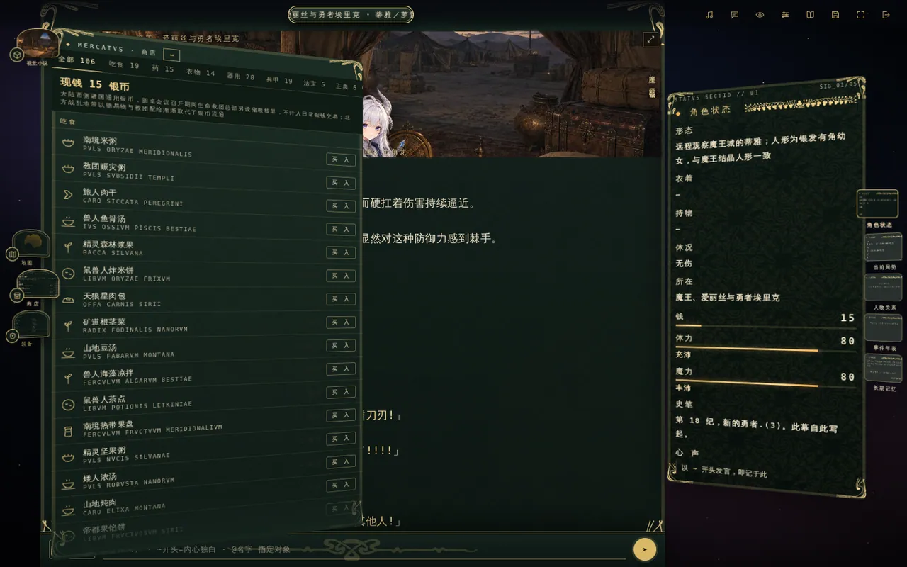

---

## 接你自己的 AI

游戏本身不带模型，也不代收任何密钥。你接自己的：

**OpenAI 兼容**（含 Gemini CLI）· **OpenAI Responses** · **Anthropic 原生** · **Google Gemini 原生** · **Mistral 原生** · **Ollama 原生**

可以存多套接口档案随时切换。还可以另外配一个**副模型**专管杂务——绘图提示词、摘要、密语闲聊都走它，省钱提速，正文仍由主模型执笔。

---

## 十二个页签的控制中枢

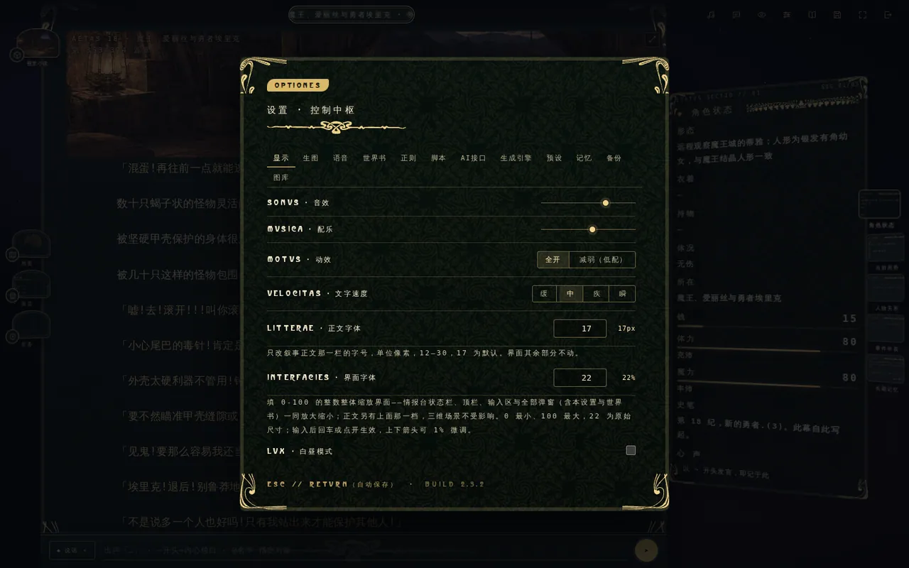

**显示 · 生图 · 语音 · 世界书 · 正则 · 脚本 · AI接口 · 生成引擎 · 预设 · 记忆 · 备份 · 图库**

底下跑的是 RisuAI 的无头运行时，所以世界书条目、正则替换、触发脚本、提示词预设、长程记忆这一整套都是真的在工作，不是摆设。正文出来之后想改一处措辞，写条正则就行；想给模型加一条只有你知道的规矩，写条世界书就行。

### 世界书

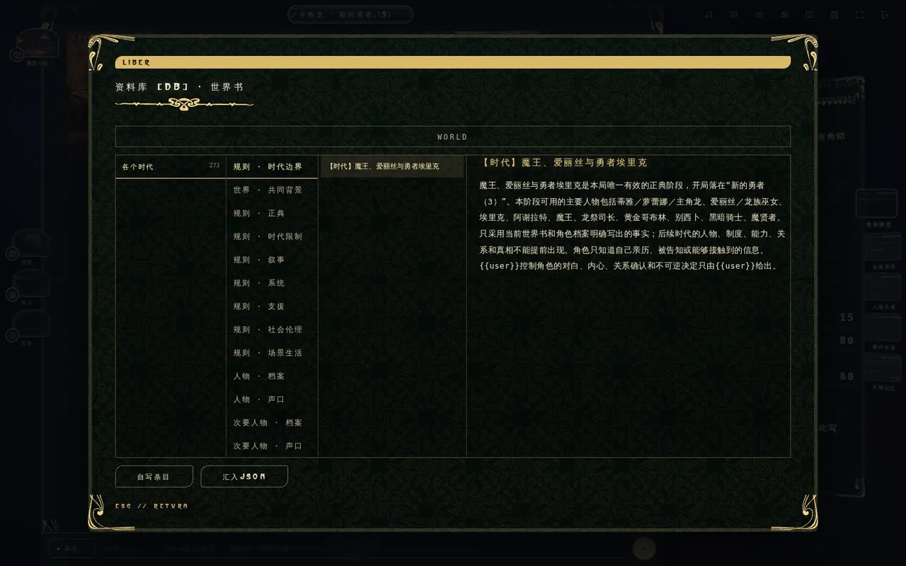

这一纪送进模型的东西全在这里摊开着，按 **世界 · 共同背景 / 规则 · 正典 / 规则 · 时代边界 / 规则 · 叙事 / 人物 · 档案 / 人物 · 声口 / 次要人物 · 档案** 分门别类，一条一条都能点开看正文。看得见，才知道模型为什么这么写。想加自己的设定，「自写条目」或者直接汇入一份 JSON。

长跑不失忆：早先的正文会被压成分层记忆随上下文送回去。设置里也能自己手写长期记忆条目，或者按一下「自动摘要近幕」，让副模型把最近十幕压成一条。

---

## 存档

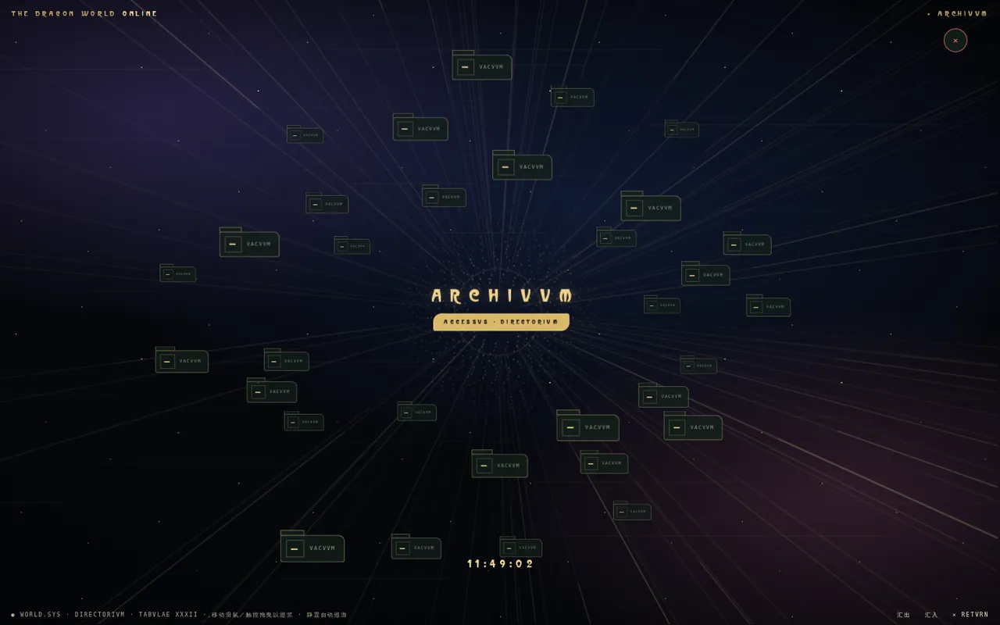

存档是一片可以拖着走的星域，三十二枚档位飘在里面，静置就自动巡游。每一档记着纪年、地点、角色、同伴、你自己改过的地形与立起的城，以及整局的正文。整份存档可以汇出成 JSON 带走，也能汇回来。

设置里另有一套分项备份：接口档案、预设、世界书、正则、脚本、记忆各自可以单独导出导入，也可以一个 JSON 全量带走。

---

## 分量

| | |
|:--|--:|
| 纪年 | 32 |
| 取材 | 原作全 649 章（第 5–653 条） |
| 可选角色卡 | 273 张（每纪 5–14 张） |
| 在册配角 | 197 位 |
| 世界书条目 | 5,177 |
| 器物 | 4,333 件 · 319 套行装 |
| 星球地点 | 41 处（38 地表 · 3 入口） |
| 时代地形 | 10 套 |
| 立绘 | 273 张 |
| 视觉小说场景背景 | 379 张 |

---

## 素材与许可

程序代码以 MIT 许可开放。游戏文本、设定数据与美术素材**不在** MIT 范围内——这是一部同人作品，原作的一切权利属于其作者与版权方。第三方组件（RisuAI 运行时、three.js、字体）各自遵循原始许可。详见 [LICENSE](LICENSE)。

新艺术装饰素材的逐件来源记在 [`core/res/img/nouveau/CREDITS.md`](core/res/img/nouveau/CREDITS.md)。

本作不出售、不接受赞助，也没有任何付费内容。若原作权利方希望下架任何内容，开 issue 即可。
